# Clean Ticket Flow

**An ATM maintenance ticketing app for iOS.** Three user roles (bank custodian, dispatcher, field technician) work from one shared database as a single source of truth, following a ticket from first report to resolution.

  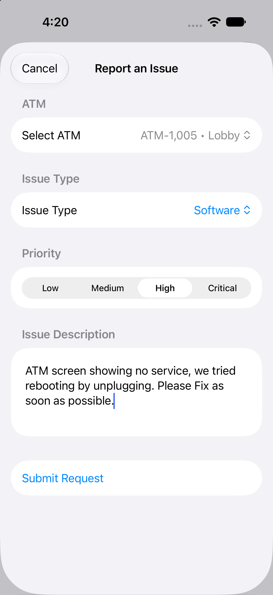
  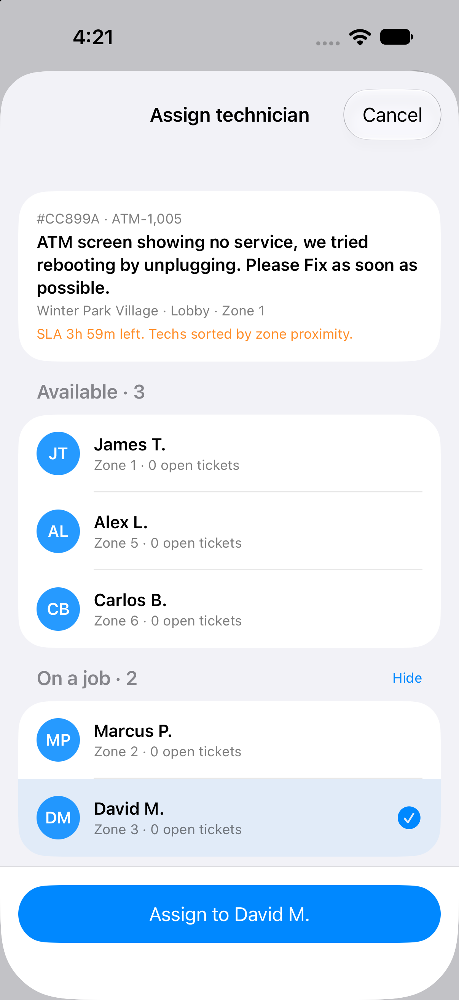
  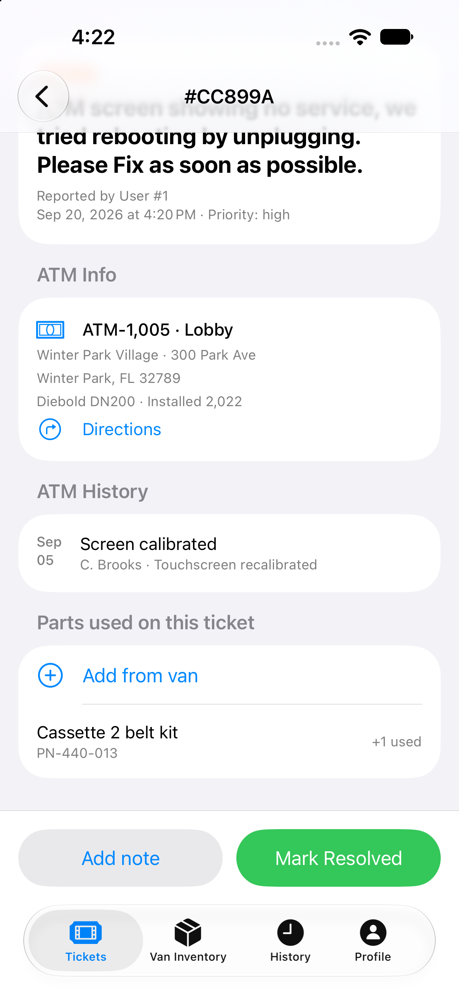

## What the App Does

Clean Ticket Flow lets bank **custodians** report ATM problems and follow their tickets. **Dispatch** then triages and assigns the work, and **technicians** carry it out in the field. Each role signs in with its own credentials and sees only the tools it needs.

### Custodian: report and track
- Report an issue by choosing the ATM, issue type, priority (Low to Critical) and a description
- Track open and resolved tickets, with a progress bar: Submitted → Assigned → In progress → Resolved
- View every ATM at the branch and its current status

| Sign in | Branch home | Report an issue | My Tickets |
|:---:|:---:|:---:|:---:|
| 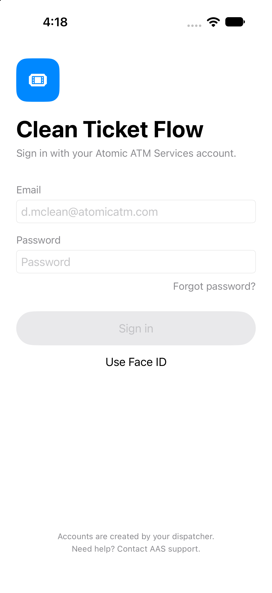 | 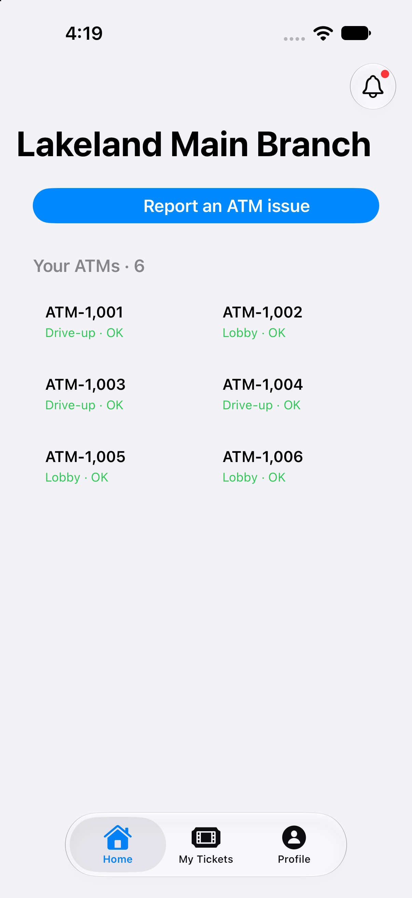 |  | 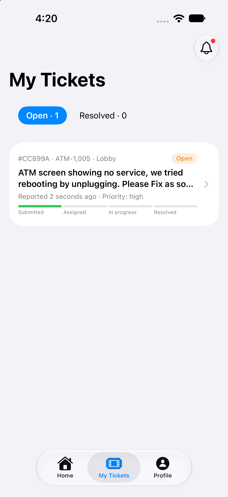 |

### Dispatch: assign and oversee
- Assign tickets to technicians, with techs sorted by zone proximity and availability
- Cancel tickets that aren't covered by the company
- See field activity at a glance: who is on shift, busy or available
- Watch SLA countdowns on every ticket in the queue
- Generate SLA reports: compliance by month, average resolution time, tickets by issue type

| Dispatch queue | Assign technician | Technicians | SLA reports |
|:---:|:---:|:---:|:---:|
| 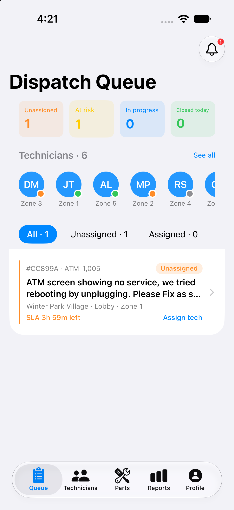 |  | 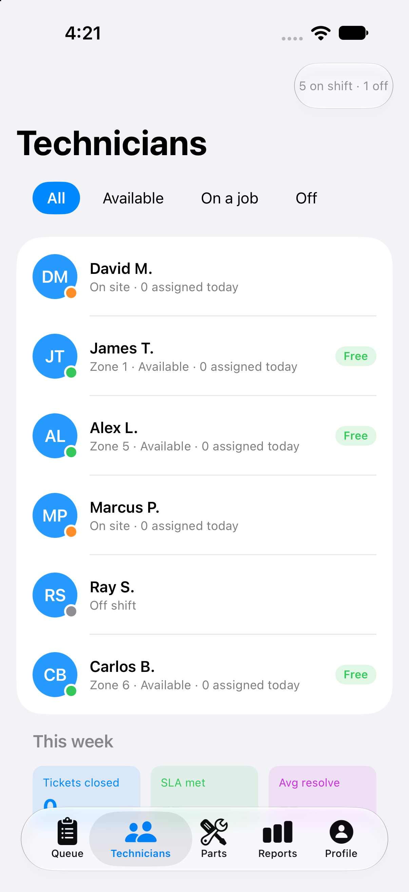 | 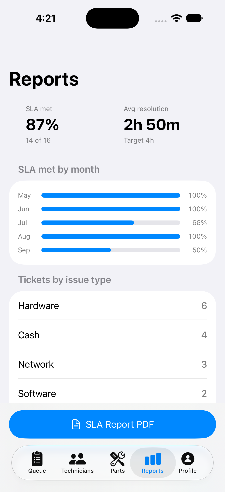 |

### Technician: work the ticket
- View tickets assigned by dispatch, sorted by SLA deadline
- Open a ticket for ATM details, model, location and service history
- Tap **Directions** to open a maps app with the location pre-loaded
- Move a ticket through **En Route → On Site → Marked Resolved**
- Add parts from van inventory and add notes to the ticket
- Check van inventory, with low-stock warnings and a restock request
- Review a history of completed tickets with average SLA resolution time

| My Tickets | Ticket detail | Parts and resolve | Van inventory | History |
|:---:|:---:|:---:|:---:|:---:|
| 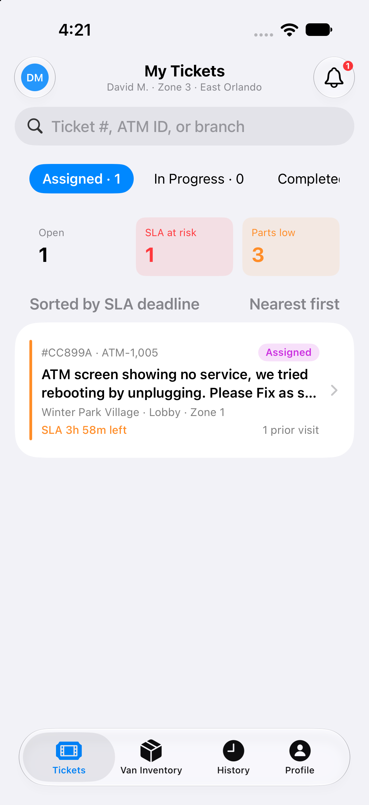 | 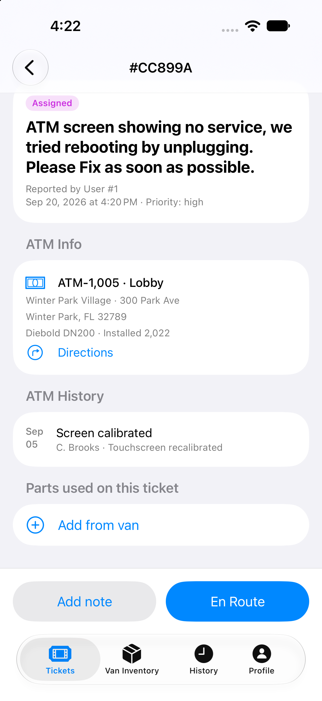 |  | 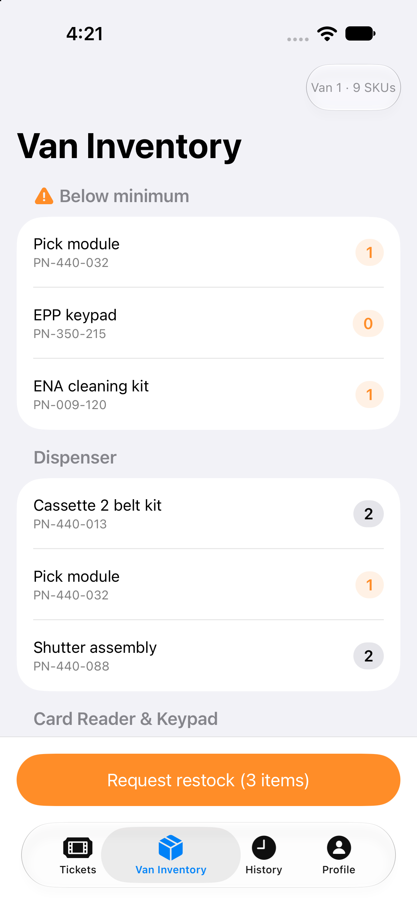 | 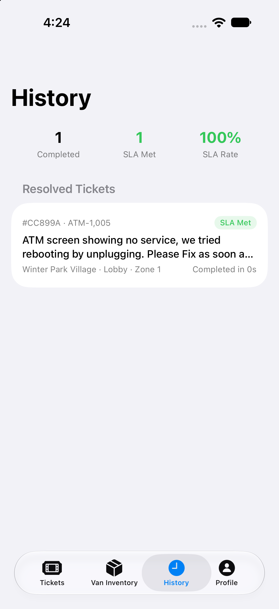 |

### Built-in search
Search by ticket number, ATM ID or branch, for when things get busy.

## Tech Stack
- **Swift**
- **SwiftUI** for the interface
- **SwiftData** for persistence, shared across all roles
- **Swift Testing** (Apple's testing library)
- **Foundation**

## Roadmap

**Notifications** are not yet implemented. They would alert every role when a ticket's status changes. Technicians and dispatch are the top priority, since they need to know about changes as soon as possible.
